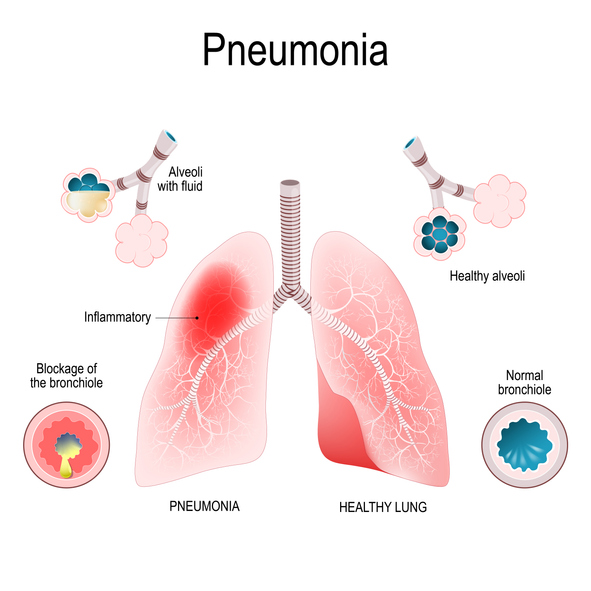
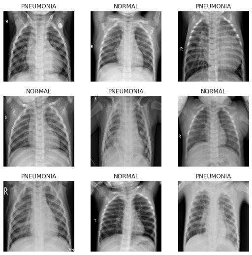
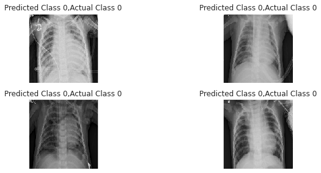
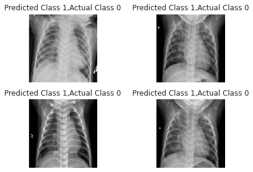

# Pneumonia-Detection
It is  CNN based model which predict  pneumonia from chest-X-ray image with 92% accuracy.  

## What is Pneumonia?
Pneumonia is an inflammatory condition of the lung affecting primarily the small air sacs known as alveoli.Symptoms typically include some combination of productive or dry cough, chest pain, fever and difficulty breathing. The severity of the condition is variable. Pneumonia is usually caused by infection with viruses or bacteria and less commonly by other microorganisms, certain medications or conditions such as autoimmune diseases.Risk factors include cystic fibrosis, chronic obstructive pulmonary disease (COPD), asthma, diabetes, heart failure, a history of smoking, a poor ability to cough such as following a stroke and a weak immune system. Diagnosis is often based on symptoms and physical examination. Chest X-ray, blood tests, and culture of the sputum may help confirm the diagnosis.The disease may be classified by where it was acquired, such as community- or hospital-acquired or healthcare-associated pneumonia.

## About Dataset

[Chest X-ray Dataset](https://www.kaggle.com/paultimothymooney/chest-xray-pneumonia)

The dataset is organized into 3 folders (train, test, val) and contains subfolders for each image category (Pneumonia/Normal). There are 5,863 X-Ray images (JPEG) and 2 categories (Pneumonia/Normal).

Chest X-ray images (anterior-posterior) were selected from retrospective cohorts of pediatric patients of one to five years old from Guangzhou Women and Children’s Medical Center, Guangzhou. All chest X-ray imaging was performed as part of patients’ routine clinical care.

For the analysis of chest x-ray images, all chest radiographs were initially screened for quality control by removing all low quality or unreadable scans. The diagnoses for the images were then graded by two expert physicians before being cleared for training the AI system. In order to account for any grading errors, the evaluation set was also checked by a third expert.

## Building Model
Model Using Keras There are two different ways of defining the Model in Keras:

* Sequential Model
* Function API

Functional API is used to build a more complicated Model such as for multi-output Models, directed acyclic graphs, or models with shared layers.

I am using the Sequential Model in this notebook to keep things simple. In Sequential Model, you can add each layer sequentially.

<b>Description of Model:</b>

* 5 Convolutional Blocks Each block consists of 1 Conv2D layers with RelU activation layers. Then a MaxPool2D layer and some of Dropout Layers.

* Then Dense Layers and Output layer after Flatten layer.

* MaxPool2D layer is used to reduce the size of the image. Pool size (2,2) means reducing the image from (150,150) to (75,75). Reducing the features.

* Dropout layer drops the few activation nodes while training, which acts as regularization. Do let the model to over-fit.

* Output layer has 1 nodes with sigmoid activation.
## Correct predictions of model

## Incorrect Predictions of model

